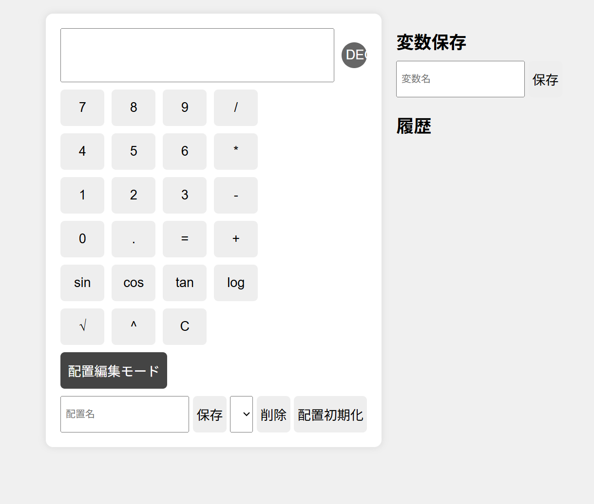

# 🧮 完全カスタマイズ電卓アプリ

高度な機能とカスタマイズ性を備えた電卓アプリです。  
ブラウザ上で動作し、VS Code等で簡単にプレビューできます。

---

## 📸 スクリーンショット

---

## 🛠 機能一覧

### 基本機能
- 四則演算（+, -, ×, ÷）
- 小数点計算
- π（パイ）入力
- DEG / RAD 切替
- 関数計算（sin, cos, tan, log, √, ^）

### 高度機能
- 関数入力時にカッコ自動補完
- カーソル位置自動移動
- 計算履歴表示・呼び出し
- 保存変数機能（最大18個）
  - ワンクリック保存・呼び出し
  - 編集・削除可能
- 配置カスタマイズ機能
  - ドラッグでボタン位置入れ替え
  - 配置の保存・呼び出し・削除・初期化
- DEG / RAD 切替ボタン
- 配置編集モード

---

## 📦 ファイル構成
/calculator-app
│
├── index.html # メインHTML
├── style.css # スタイルシート
├── script.js # JavaScript
├── screenshot.png # アプリのスクリーンショット
└── README.md # 本ファイル

---

## 🚀 使い方

1. このフォルダをローカルに保存  
2. `index.html` をブラウザで開く  
3. 数字・演算子・関数ボタンをクリックして計算  
4. 「DEG / RAD」ボタンで角度単位を切り替え  
5. 「保存」機能で変数を保存・呼び出し  
6. 「配置編集モード」でボタンの位置を変更可能  

---

## 🎨 カスタマイズ方法

- ボタンの配置はドラッグ＆ドロップで変更可能  
- 配置は保存して呼び出し可能  
- 保存変数は自由に名前付け・編集・削除可能  

---

## 💡 注意事項

- 関数は JavaScript の `Math` オブジェクトを利用しています  
- 不正な入力は `"Error"` と表示されます  
- 配置や変数はブラウザのローカルストレージに保存されます  

---

## 📄 ライセンス

MIT License  
© 2025

